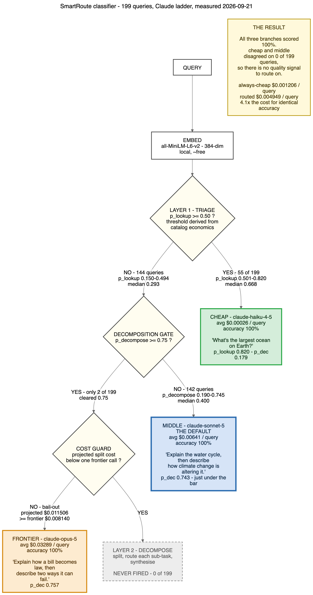

# SmartRoute

An LLM inference router that sends each request to the cheapest model that can handle it — and the benchmark harness that tells you whether routing is worth doing at all.

The router is real and works. The harness is the reason this repo exists: run it against your own traffic before you believe anyone's cost-savings claim, including this one.

---

## The headline finding

On 200 questions written to resemble everyday assistant traffic, against a Claude
ladder of Haiku 4.5 → Sonnet 5 → Opus 5:

| arm | $/query | accuracy | |
|---|---|---|---|
| **always-cheap** | **$0.001206** | **100.0%** | ← winner |
| routed | $0.004949 | 100.0% | 4.1× the cost |
| always-middle | $0.004981 | 100.0% | 4.1× the cost |
| always-frontier | $0.014174 | 100.0% | 11.8× the cost |

All four arms scored identically. Across 199 completed queries, the cheap and middle
tiers **disagreed on zero of them**. With no quality signal to route on, routing is
pure added cost.

That is not a bug in the router — layer 1 works, diverting 49 of 50 lookups to the
cheap tier at 1.03× the cost of always-cheap on that category. It is a finding about
the traffic: everyday assistant questions sit inside the cheapest model's competence,
so there is nothing to escalate for.

**Routing pays only when some traffic actually fails at the cheap tier.** If yours
does, this harness will show you; if it doesn't, it will save you from shipping a 4×
bill for nothing. [Full benchmark documentation →](BENCHMARK.md)

---

## Quickstart

Requires Python 3.13+ and [uv](https://docs.astral.sh/uv/).

```bash
git clone <repo> && cd SmartRoute
uv sync --extra server --extra ml --group dev
cp .env.example .env          # add one provider key

uv run pytest                 # 202 tests, no network
```

Route a request as a library:

```python
from smartroute import Router

router = Router()                                  # reads models.yaml
answer, decision = router.route(
    [{"role": "user", "content": "What's the capital of Australia?"}]
)

print(answer)                   # "Canberra."
print(decision.route_path)      # "cheap"
print(decision.gate_reason)     # "lookup p=0.76 >= 0.5"
print(decision.estimated_cost_usd)
```

Or run it as an OpenAI-compatible server and change one `base_url`:

```bash
uv run smartroute-server        # POST /v1/chat/completions on :8000
```

Routing metadata comes back in the `X-SmartRoute-Meta` response header — path taken,
why, projected cost, sub-task count — so the response body stays 100% OpenAI-compatible.

Measure it on your own traffic:

```bash
uv run --extra ml harness/eval_routing.py --compare          # routing accuracy, offline, $0
uv run --extra ml harness/run_routing.py --n 200 --arm all   # live cost/accuracy, all arms
```

---

## How routing works



Three decisions, each cheap enough to run on every request:

**Layer 1 — triage.** A logistic-regression head over a frozen MiniLM embedding
estimates `p_lookup`: is this the kind of question someone would have typed into a
search box? The encoder is the one `cache.py` already loads for the pgvector semantic
cache, so on a cache-enabled deployment the prompt is embedded once and used twice.

**The gate.** A second head estimates `p_decompose`. Below the threshold the request
goes to the middle tier — the default. The frontier tier is never a default
destination; it is reached only when the gate's cost arithmetic prefers it, or via
layer 2's bail-out.

**Layer 2 — decomposition.** The middle model splits the request into sub-tasks,
each routed independently, then synthesises. Guarded by a hard dollar check: if the
projected split cost already exceeds one frontier call, the plan is discarded and that
call is made instead.

### Thresholds are derived, not guessed

Diverting a lookup saves `(middle − cheap)` when right and costs `λ` when wrong, so
breaking even requires:

```
precision = λ / (saving + λ)
```

`λ` — what a wrong answer costs you, in dollars — is the single operator knob, set in
`models.yaml`. The trainer persists a measured precision/recall curve; the decision
layer picks the lowest threshold clearing the bar, and **disables layer 1 entirely**
if no threshold reaches it.

This matters more than it sounds. On the Together AI ladder the required precision is
88.3% at λ=$0.001; on the wider-spread Claude ladder the same λ demands only 38.1%,
which drops the threshold to 0.50 and sends 39% of multi-hop work to the weakest model.
Same formula, same λ, opposite behaviour — because the economics changed underneath it.
Set `λ` to what a wrong answer actually costs you.

---

## Model-agnostic by construction

Every model, price, and tier lives in `models.yaml`. Swapping providers is a config
edit, and there is a test asserting exactly that.

```yaml
models:
  - {alias: cheap,    id: claude-haiku-4-5-20251001, role: cheap,    env_key: ANTHROPIC_API_KEY}
  - {alias: middle,   id: claude-sonnet-5,           role: middle,   env_key: ANTHROPIC_API_KEY}
  - {alias: frontier, id: claude-opus-5,             role: frontier, env_key: ANTHROPIC_API_KEY}
routing:
  tiers: [cheap, middle, frontier]
  default_tier: middle
decision:
  lambda_wrong_answer_usd: 0.01
```

The catalog refuses to load a configuration it cannot reason about:

| guard | why |
|---|---|
| unpriced model → `UnpricedModelError` | silently recording $0.00 corrupts the only number the project reports |
| tier ladder must ascend in price | "escalate" is meaningless otherwise |
| judge must differ in model family from the tier it grades | otherwise it grades its own homework |
| `unsupported_params` per model | Sonnet 5 and Opus 5 reject `temperature` with a hard 400; Haiku accepts it |

Prices resolve from LiteLLM's registry (4,326 models) with a YAML override. Shipped
catalogs: `models.yaml` (Together AI), `models.anthropic.yaml`, `models.groq.yaml`.

---

## What's in the box

```
src/smartroute/
  catalog.py      models.yaml → ModelSpec, prices, validation guards
  decision.py     layer 1 triage, the gate, expected-cost rule
  decomposer.py   layer 2: split, route sub-tasks, synthesise, bail out
  router.py       orchestration, cache, decision logging
  providers.py    provider seam; catalog is the pricing authority
  server.py       OpenAI-compatible FastAPI app
  cache.py        NoOp / in-memory LRU / pgvector semantic cache
  db.py           Postgres decision log with migrations
  observability.py  Prometheus metrics, JSON logs, OTel traces

harness/
  corpora.py        dataset protocol + the 200-question corpus + graders
  data/synthetic_corpus.py   the corpus source, with assertions
  train_triage.py   fit the two heads, persist the calibration curve
  eval_routing.py   routing accuracy, offline, $0
  run_routing.py    live cost/accuracy across arms
```

202 tests, no network required.

---

## Status and honest limits

The router, catalog, harness, server, cache, and observability are built and tested.
What you should know before trusting any of it:

- **The corpus is saturated.** Every tier answers it correctly, so it cannot
  discriminate between them. A useful routing benchmark needs questions the cheap tier
  demonstrably fails.
- **Grading measures term presence, not answer quality.** It rejects wrong, vague, and
  evasive answers (verified 7/7 adversarially) but cannot distinguish "correct but
  shallow" from "correct and excellent". A premium tier cannot demonstrate value under
  this metric even if it deserves one.
- **The decompose head does not work.** Precision 0.18 — 30 positives split for
  training is far too few. Multi-part requests route to the middle tier.
- **Layer 2 has never executed.** On a 5× cheap→frontier spread, decompose plus
  synthesis costs more than a single frontier call, so the dollar guard suppresses it
  every time. Decomposition needs a wide ladder to be viable.
- **The cascade verifier is disabled.** The previous judge (Qwen2.5-72B, $1.20/M) cost
  1.44× the frontier call it existed to avoid, at every output length. Replacing it
  with free logprob signals is unstarted.

---

## Contributing

The most useful contribution is a corpus that defeats the cheap tier. See
[BENCHMARK.md](BENCHMARK.md#adding-your-own-corpus) — a corpus is a JSONL file plus a
grader, and dataset membership supplies the routing labels.

```bash
uv run pytest                    # must stay green
uv run --extra ml harness/eval_routing.py --compare   # routing didn't regress
```

## License

Not yet licensed. Contact kartikay3@outlook.com.

*Last reviewed: 2026-09-22.*
